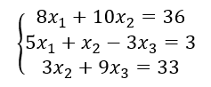
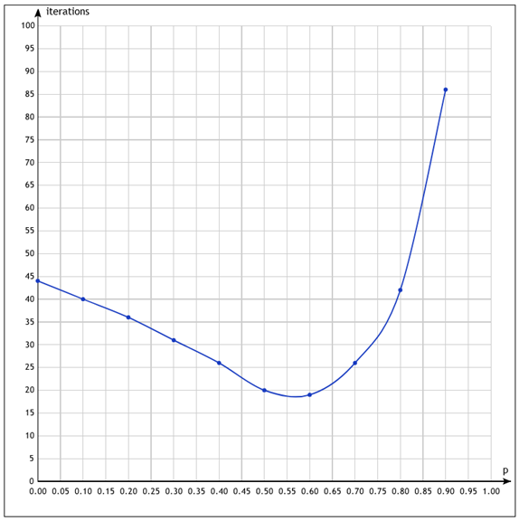

# *Решение системы линейных уравнений методом Зейделя*

 Решить систему линейных уравнений методом Зейделя с точностью $ε=10^{-3}$. Исследовать зависимость числа итераций от ускоряющего параметра релаксации $0≤p<1$, изменяя значения $p$ с шагом $0.1$. При выполнении задания необходимо привести систему уравнений к виду, обеспечивающему выполнение достаточных условий сходимости метода Зейделя.

**График зависимости числа итераций от ускоряющего параметра**

